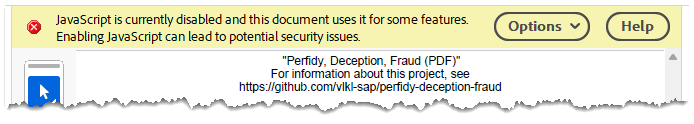

# Perfidy, Deception, Fraud - How Much Trust Should We Put in a PDF?

In this experiment, we demonstrate how to create a **malicious PDF document** that
1. **changes its displayed content with time** (while the file stays the same)
2. **displays different content to different people**

In the first scenario, an attacker can get the victim to agree to something, while later misrepresenting what the victim agreed to.

In the second scenario, an attacker can leverage a "confused deputy" to defraud a third party. Imagine sending a PDF to a person having approval authority with a message "please approve this invoice and forward to the payment department". In the payment department, the "approved" invoice displays a different claimant and/or amount than to the approver.

## Repository Contents

This repository contains:
* an example [proof-of-concept PDF](perfidy-deception-fraud.pdf)
* a script to generate such PDFs (using [PDF-LIB.js](https://pdf-lib.js.org/))

## How it Works

In our daily life, we often think of PDF documents as static and immutable. This mental model is wrong.

A PDF document can contain "forms" and a dynamic behavior via embedded JavaScript code attached to these forms. We note that there are hardly any constraints on what a form can look like. In our proof of concept, the form field covers the complete visible document area. It is  possible to build convincing documents that integrate forms organically in other ways, though.

The text of our document is generated by the JavaScript program embedded in the document. The generation happens **in the reader**, at the time of opening the document.

So what can an embedded program do? The APIs available to it are limited, but the limitations are mostly centered around preventing the program from changing the state outside of the PDF reader.

The program has read access to the **real-time clock** (the `Date` object, specifically), which already enables attack scenario #1. Furthermore, the `Date` also tells the program about the time zone and the locale of the system running the PDF reader. In certain scenarios (multinational corporation or other distributed organization), this information already suffices to discriminate between relevant groups of people to enable attack scenario #2. The discrimination can be made much more precise because the program can find out the location of the document file on disk. This location will often contain the exact **username** of the person viewing the document.

## Affected Readers

Some test results are below. Not all readers implement the necessary forms and JavaScript capabilities. If you have a correction or another major datapoint, feel free to share by opening an issue.

OS | Reader | Status
--- | --- | ---
Any | Chrome | affected
Linux | Firefox | affected
Linux | Evince | no forms/JS
macOS | Preview | no forms/JS
Android | Google PDF Viewer | no forms/JS
Windows | Adobe Acrobat | JS off by default, warning (see below)

## Impact, Mitigations, Vendor Responses

A popular PDF reader among the affected ones is Chrome. I have [reported](https://issues.chromium.org/issues/398554952) the issue but the report was promptly dismissed as "intended behavior". The reasoning why there is "[no] vulnerability in Chrome" is supposed to be in [this FAQ entry](https://chromium.googlesource.com/chromium/src/+/327571afc7365a1280f100ced2e384274ca9534b/docs/security/faq.md#Does-executing-JavaScript-in-a-PDF-file-mean-there_s-an-XSS-vulnerability). However, the FAQ entry is concerned with a different issue and is irrelevant to the attacks I describe, which, for one, do not require a network connection at all. I followed up, pointing out the disconnect, but there were no further responses.

To be clear, the vulnerability is not due to a "bug" in a particular PDF reader implementation. It is, rather, a consequence of the design of the PDF format and its capabilities. Nonetheless, I believe that implementors and vendors of popular software have a far-reaching duty of care towards their users. A PDF reader can, and should, help protect the user, regardless who created the risk in the first place.

A reader that is at least trying is Adobe Acrobat. It disables JavaScript by default and warns the user:

Of course, such warnings are not always without issues. The Acrobat warning is very generic and the user has no way to estimate the consequences of their decision. However, the user is made aware that *something* is going on and can opt to stay on the safe side.

In turn, since attackers have control over the document content shown in absence of JavaScript, they can try to manipulate the user to enable it. "This document is encrypted for your security. Please enable JavaScript to view it." Such bypasses are par for the course for many security mechanisms, though.

To be fair, society's smooth working is not exclusively rooted in a technically-enforced immutability of documents. To a large extent, it relies on an effective legal system that deters illegal actions through the risk of punishment. Nonetheless, PDF content attacks can increase the risks and friction of doing business, and it is unwise to ignore them.

## Related Work

Obviously, PDF scripting capabilities were never a secret. However, I could not find a mention of security attacks exploiting these capabilities in the way described above.

At the same time, people have previously "abused" PDF scripting in various creative ways. Worth mentioning are such feats of engineering as implementing the [game of Tetris](https://github.com/ThomasRinsma/pdftris) or a [complete Linux operating system](https://github.com/ading2210/linuxpdf) running inside a PDF document.  

If you have any comments or feedback, let me know by opening an issue.

